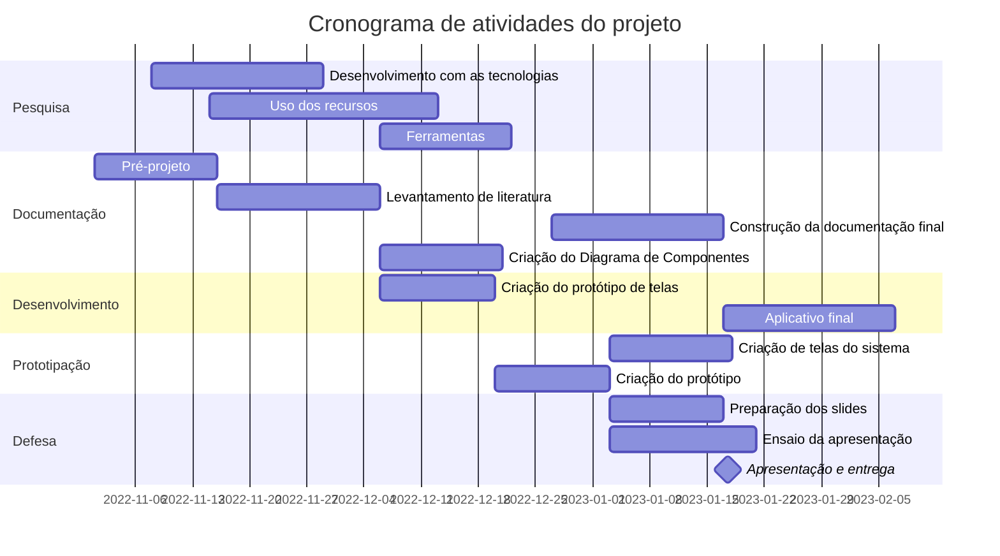
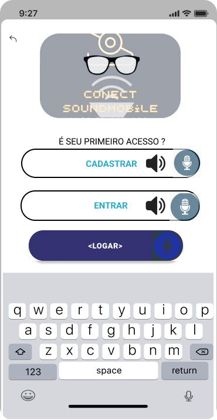

# CRIAÇÃO DO DIAGRMA DE GANNT - DISCIPLINA DE PROJETO INTEGRADOR I - "Projeto de Desenvolvimento de Software no Aux. de Deficientes visuais"!

### Mermaid permite criar e visualizar diagramas.

Este exemplo é um modelo de cronograma simples, documentação sobre o gráfico de está [disponível aqui](https://github.com/mermaid-js/mermaid/blob/develop/docs/gantt.md).

## O cronograma pode prever os seguintes tópicos sugeridos:

- Levantamento da literatura: quanto tempo você demora para ler e organizar as referências bibliográficas? 
- Escolha do instrumento e preparação para coleta de dados: quanto tempo será gasto para escolher os instrumentos que serão usados na pesquisa? (Questionários,           entrevistas e escalas, por exemplo). 
- Levantamento de dados: quanto tempo é preciso para levantar os dados que serão usados no estudo? 
- Escrita da parte teórica: quanto tempo será gasto para escrever o relatório? 
- Análise dos dados: qual é o tempo necessário para organizar os dados coletados em planilhas e tabulá-los? 
- Discussão dos resultados: quanto tempo você vai gastar para articular os seus dados com os dados de outros autores que pesquisaram as mesmas variáveis? 
- Elaboração da conclusão e referências: quanto tempo é necessário para escrever as considerações finais e colocar a lista de referências bibliográficas nas normas       da ABNT? 
- Ajustes finais: de quanto tempo você precisa para revisar a formatação? 
- Criação da apresentação: qual é o tempo necessário para elaborar os slides e ensaiar a apresentação? 
- Defesa: Quando o trabalho será apresentado para a banca? 

## DESCRIÇÃO E APRESENTAÇÃO DAS INTERFACES GRÁFICAS PARA O APLICATIVO (Jonathan)
### Esse trabalho consiste em apresentar capturas do protótipo das interfaces gráficas, e suas respectivas características para assim informar sobre as                 funcionalidades e fluxos para o aplicativo que será desenvolvido e utilizado durante o desenvolvimento do Projeto Integrador como um todo.

### Interface 1: Tela Inicial (jonathan)
Nesta tela, temos o início de toda a integração do serviço a ser disponibilizado. Com a logomarca que simboliza a característica da natureza do serviço prestado no     uso do transporte público intermunicipal. Nesta tela tem 2 opções: 1ª o de “Cadastrar usuário” pelo primeiro acesso, e 2ª opção – “Entrar” com seu cadastro pela       primeira vez, onde vai poder entrar diretamente com o uso dos dados usados para realizar seu cadastro como usuário que forma utilizados na opção anteriormente.

### Interface 2: Menu de Login (jonathan)
Nesta tela, o suário é direcionado após passar pela primeira interface para inserir seus dados pessoais nos campos - Email e Senha já com o uso do recurso (leitor captador de voz do software)  para facilitar o manuseio por parte do usuário: "deficie3ntes visuais"

.jpg)

### Interface 3: Menu de Cadastro (jonathan)
Na interface destinada ao menu cadastramento do usuário ele tem seu primeiro acesso, após a Tela Inicial. Aqui possui 3 campos de preenchimento de dados pessoais: nome do usuário, Email, senha a ser criad, e em cada um desses campos com o receio (leitor captador de voz do software) para manter acessibilidade especial. Após essa tela ele será destinado a tela Menu -4 com as opções de serviço.

_(2).jpg)

### Interface 4: Tela Menu com as opções de serviço do usuário (jonathan)
Após o usuário ter realizado a autenticação dos seus dados na Tela Menu de Login, ou efetuado seu primeiro acesso na tela de menu de cadastro. Ele será direcionado automaticamente para a "Tela Menu com as opções de Usuário", aonde por meio do recesso do recurso do leitor cpatador de voz disponibilizado, selecionar de sua preferência: a região. a linha ou frota ônibus e a proximidade com a parada em que ele se encontra, com seus respectivos campos de preenchimento, ou com a filtragem de lista de informações.

.jpg)

### Interface 5: Tela do Serviço pelo GPS ao Usuário (jonathan)
A interface da "Região de Percurso do Uusário", é a tela derivada do campo de seleção região que pertence a Interface 4, nesta tela, além dos recursos de captura de voz e leitor de informações, o usuário vai contar com o recurso já integrado do GPS, para escolher a região em que ele se encontra no momento do embarque de sua viagem (Ponto de Ônibus).

.jpg)

### Interface 6: Tela de Seleção de Linha/frota de ônibus usuário.
A interface da "seleção de frotas/linhas", é a tela do campo respectivo da Interface-4 - tela com as opções de serviço. Onde por sua vez o usuário poderá selecionar a quantidade de frotas/linhas em que queira cadastrar para o banco de daados da integração do software com o órgão de controle - prefeitua ou posteiormente ele vai poder alterar, caso ele mude de lugar por motivo pessoal ou de trabalho, estudo.

.jpg)

### Interface 7: Tela de visualização da proximidade do transporte.
A interface com da "proximidade do ônibus", é a tela derivada do campo respectivo da Interface-4 - tela com as opções de serviço, onde por sua vez o usuário poderá saber quando estiver no ponto de ônibus, a distância em que sua frota ou linha se encontra em relação aonde ele está atualmente(ponto de ônibus), com o suporte do recurso já integrado - GPS.

.jpg)

#### Interface 8: Informações Gerais Linha/ônibus com o serviço oferecido pelo usuário.
A interface com as "informações do serviço oferecido", é a Tela de Menu, destinado a informações gerais da linha/frota do transporte, nela o usuário poderá consultar por meio dos campos de seleção de informações: a quantidade usuários, histórico de viagens e a situação do usuário, como uma espécie de banco de dados do uso do aplicativo, e atualizar todas as informações quando assim precisar. 

.jpg)

### Interface 9: Exibição de informações do histórico de viagens do usuário.

## Diagrama de Componentes: 
img/MODELO DE DIAGRAMA DE COMPONENTES - FORMATO UML (1).png

    

    
    
    
   
